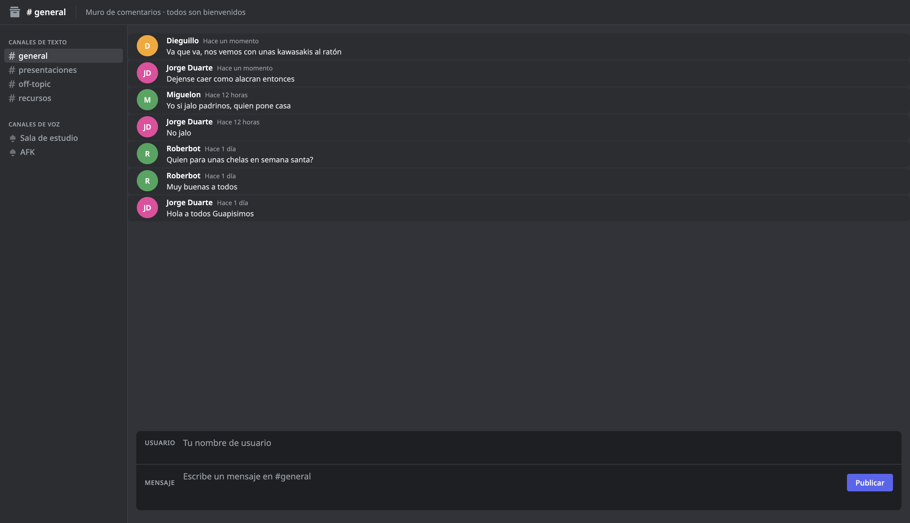

# Comment Wall App

Aplicacion que permite crear comentarios con nombres de usuarios existentes en la Base de datos mysql.

## Instalacion

### Clonar Repositorio

```Bash
git clone https://github.com/Naraka28/comments-front.git
cd comments-front
```

## Ejecución:

Dado que el proyecto utiliza Módulos de JavaScript, debe ejecutarse a través de un servidor local.

Si usas VS Code, utiliza la extensión Live Server.

Abre `index.html` en tu navegador.

## URL de la pagina hosteada

Acceder a traves de este link [Comments Wall App](https://capable-pothos-768edb.netlify.app/)

## Preview de la aplicacion


